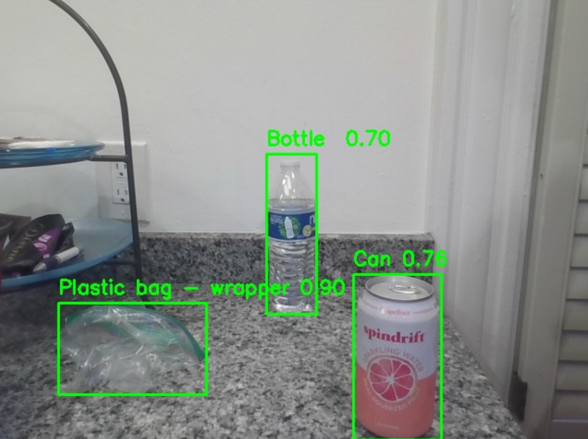

# NMH Waste Sorter: Program Description

NMH Waste Sorter is built by Alan, Joelle, Lorcan, and Siddiqi. This program uses a YOLO model fine-tuned on the TACO dataset to determine if an object on camera or in an image is recyclable or trash.

---

## Folder Structure

```bash
|WASTE-SORTER/
|   runs/detect                 # YOLO training logs 
|   static/             
|       css/
|           home.css            # Stylization for homepage
|   templates/              
|       base.html               # Layout for homepage; calls model endpoint
|       home.html               # Fills homepage content
|   .gitignore                  # Ignore pycache and venv folders
|   README.md                   # Documentation   
|   counting.py                 # Some dataset exploration
|   main.py                     # Main program file
|   model.py                    # Training file for model
|   utils.py                    # Helper functions
|   webcam.py                   # Testing YOLO model for family day!
|
```

Datasets were included inside the project directory.

---

## Dataset

The YOLO formatted TACO dataset was used in training: https://www.kaggle.com/datasets/vencerlanz09/taco-dataset-yolo-format

The TACO dataset has 18 classes:
Aluminium foil, Battery, Blister pack, Bottle, Bottle cap, Broken glass, Can, Carton, Cigarette, Cup, Food waste, Glass jar, Lid, Paper, Paper bag, Plastic bag & wrapper, Plastic container, Plastic gloves, Plastic utensils, Pop tab, Rope, Scrap metal, Shoe, Squeezable tube, Straw, Styrofoam piece, Other plastic, Unlabeled litter

Which were merged into the following:
Recycling or Trash

---

## Training

### YOLOv8s
1. Trained with Adam optimizer for 100 epochs
2. Fine-tuned with SGD for 200 epochs
3. Continued with SGD for 150 epochs with augmentation=True

### YOLOv8m
1. Trained with Adam optimizer for 100 epochs
2. Fine-tuned for 200 epochs with augmentation=True
---

## Deployment

1. Clone the repository: `git clone ...`
2. Create and activate a virtual environment
3. Install dependencies: `pip install -r requirements.txt`
4. Run: `python main.py`


---

### How to Use

In **main.py** Choose either v8m or v8s:
```
model = YOLO("runs/detect/v8m/weights/best.pt") # larger model, recommended for computers with CUDA GPUs
```
Or 
```
model = YOLO("runs/detect/v8s/weights/best.pt") # smaller model, recommended for computers without CUDA GPUs
```

Next, if desired, specify result properties:

Default:
```
results = model(frame, verbose=False)
```
If webcam feed is choppy, try reducing image size (default is 640px)

```
results = model(frame, verbose=False, imgsz=100)
```
Lastly, run main and you should be prompted with the address to a local flask web app.

---

### Demo

Screenshot of webcam feed detection (values indicate model confidence)



---

## Task split

Alan: frontend
Lorcan: train model
Joelle: initial file structure and README.md file, model validation
Siddiqi: backend/helper functions
All: testing & debugging

---

## Progress 09/24

- Alan: More frontend/Flask work.
- Joelle: Update README.md file, got model to run on her machine, work on eliminating classes without enough images, pushed work in progress to Github.
- Lorcan: Added SGD to improve model, which boosted mAP. Added webcam file for testing purposes, pushed to Github.
- Siddiqi: Work on function to decide which specific categories go to trash, recycling, or other.

---

## Progress 09/25

- Alan: Finish frontend work and pushed -> integrated video feature and writing output
- Joelle: Update README.md file, model acc (working on understanding/preprocess data)
- Lorcan: Merged everything to MVP branch, testing functionality, look at ways of improving model accuracy
- Siddiqi: Finished function for mapping, helped test final project


